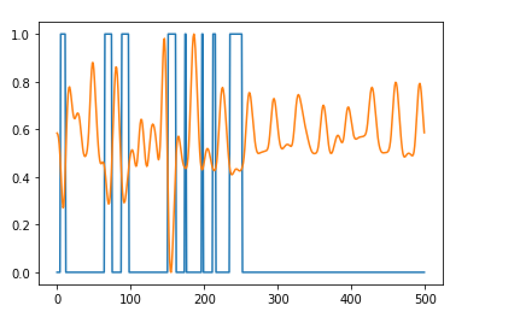
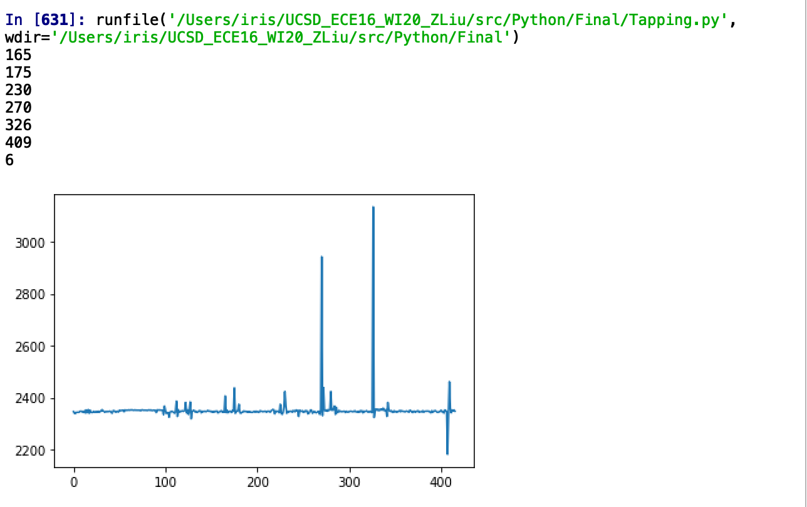
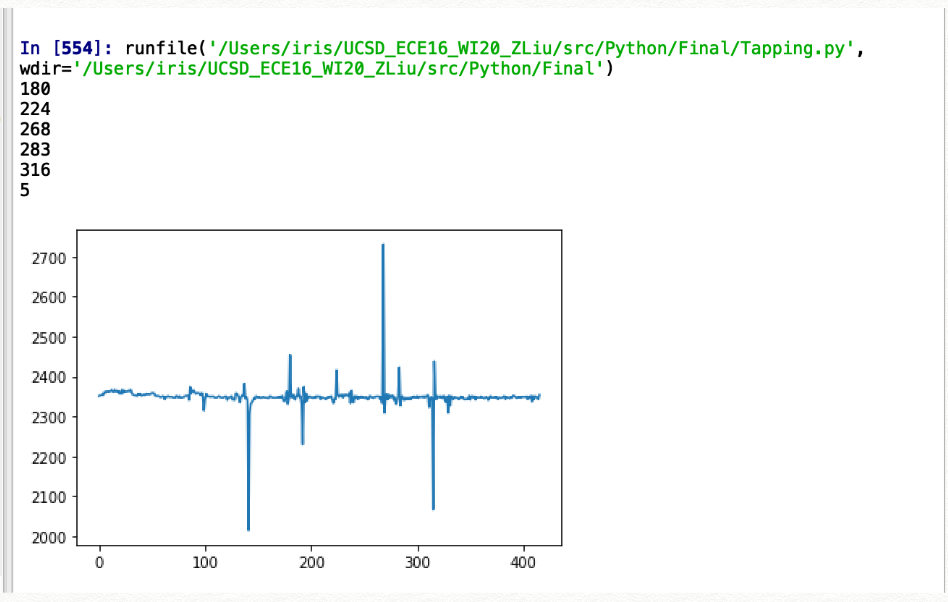
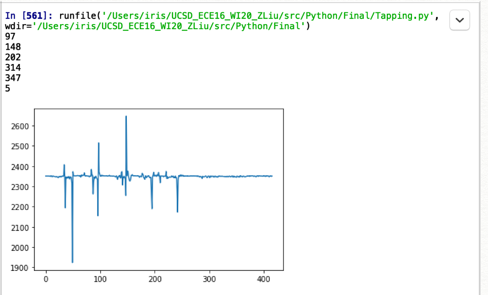
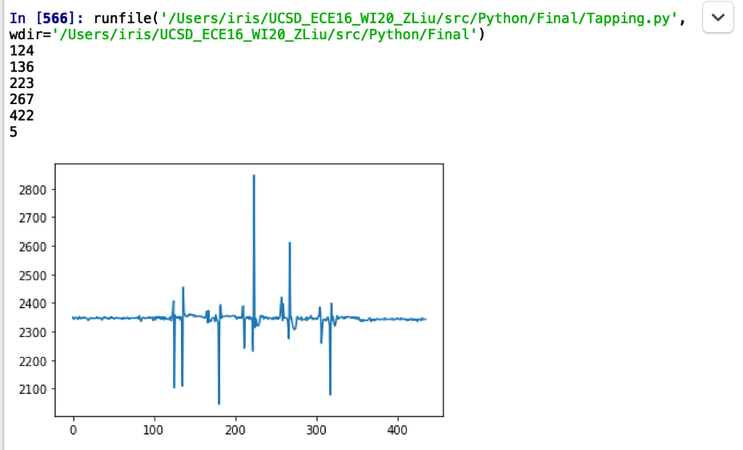
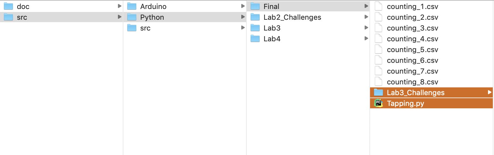
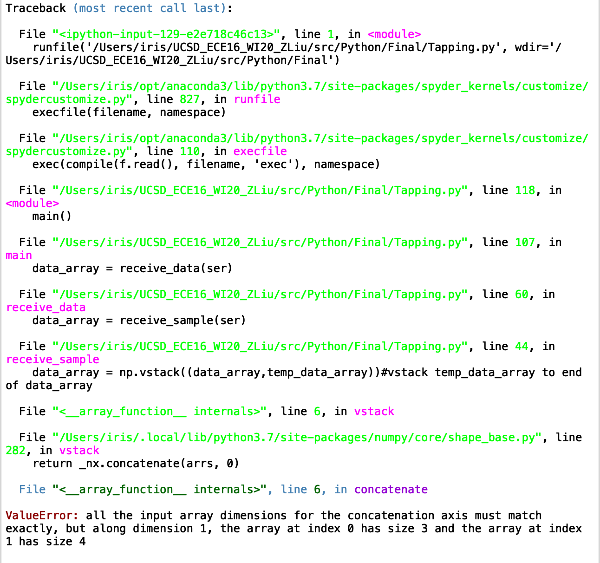

#  Document Potential Failure 

## Issues with the tap 

1. Up and down movement 

Fact: The tap dectection could fail if the accerometer was moved up and down. The up and down movement could either cover the fact that there was a tap or add a detected tap when there is actually not one. 

Reason: The current algorithm was detecting if the acceleration surpasses a certain threshold, and if the answer is yes, it counts a tap. This is because a tap usually result in a acceleration peak. When tap down and move the accrerometer was moved upward, the acceleration could possibilty keep pretty steady and do not show a peak which surpasses the threshold, and hence detect no tap. And vice verse, if the accerometer is moved downward quickly, the acceleration downward could also surpass the threshold and show a tap. 

2. Taps of different strength 

Fact: Sometimes people tap lightly and sometimes heavily. The tap detection would fail if we tap lightly using a algorithm designed for heavy taps, and the threshold is hard to determine. The issue is that it's hard to keep the same tapping strength, so it's easy to break the algorithm. 

Reason: The current algotithm would count a tap as long as the accelerameter reading is more than the set threshold, and delay for some time until the next detect, to avoid keep counting after one tap. For an algorithm designed for a heavy tap, the threshold is high. And would not count taps if the taps are light and the acceleration does not surpass the threshold. 

3. Clumsy tap 

Fact: (As a clumsy person) When tapping, I think sometimes the time I put pressure on the accelerameter is longer and very heavy, and this resulted in an oscilation, which means the reading surpasses the threshold for several times in several peaks, and resulting in several taps are detected when I only tapped it once. 

Reason: As well as described in 2, the algorithm is like: detect (and +1 if it surpasses the threshold) -> delay for a moment -> detect (and +1 if it surpasses the threshold). So, if after one time, the reading can surpass the threshold for several times, resulting in couning several taps.

## Issues with the heart rate detection 

1. Time Domain 

Fact: Sometimes there is a small peak after a heart beat peak, which could result in a one more count, if we are only counting when the different is  > 0. 

Reason: The current algorithm typically would count the start of heart beat (diff > 0), or say, count the start of a peak. This is because that a heart beat usually reaults in one peak in the signal. However, it is common in heart rate signal that a big peak is followed by a smaller peak after one heart beat. 

2. Frequency Domain 

Fact: Sometimes the highest peak is from the noise, and the second highest peak is that of heart beat, and then the calculated heart rate is from the biggest freqnency component of noise, and hence is wrong. 

Reason: Algorithm would only select the biggest frequency component as the main frequency and calculate heart rate according to it, cuz usually the frequency of heart rate is the dominant frequency. But this is not always the case. 

3. Machine learning. 

Fact: The performance of machine learning really depends on the tidyness of the data. Sometimes if the data don't look like sharp peaks after all the data processing, it would fail. 

Reason: The algorithm was trying to fit the data into a 2 Gaussian mixture model, because that's usually what the data should be like. But sometimes because of non-perfect measurement, it could fail. 

# Challenge Choice 

Improving the robustness of the tapping counting  greatly. 

### Why it's worth to be fixed

The issue led very unaccurate and vulnerable taps detecting.  This challenge would improve the robustness of the tapping counting  greatly. 

After the modification, too light/heavy/long/short tapping would not cause a problem, and a fixed threshold is not needed. 

### Replicating the issue 

As we can see from the following picture, sometimes it does not count a tap after I tap it, and sometimes it count twice after i tap once. 

Since this showed both the overcounting and the undercounting situcation, it is enough to test the issue. 

### How current algorithm failed 

 The fact: in the gif. above. Original: 19; After one tap: remains the same; After one tap: 21. 

The codes: the current algorithm is like: read from the accelerameter -> detect (and +1 if the accelerameter reading surpasses the threshold) -> delay for a moment -> detect (and +1 if it surpasses the threshold). So, if after one time, the reading can surpass the threshold for several times, resulting in couning several taps. Also, if the threshold is two high, light tapping cannot be detected. However, if the threshold is too low, the non-main peaks after one tap is more likely to be detected as taps. 

# Implement the Solution

### Solution 

As we used peak detection method in the heart rate calculation, I used the same method for the tapping detection. 

I used python to receive accerameter reading as used scipy to do tapping detection. And then, I used scipy signal package to detect the peaks. To avoid counting several times after one tap, a peak would be compared to the neighboring accelerameter reading to judge if it is the "main peak" after one tap. If it's indeed extrodinarily higher than its neighbour samples, I judged it as a tapping. 

#### Working Implementation 

From this graph, we can see that it could detect both very light tap and very heavy tap (very short peaks and very high peaks.) 

The first 6 printed numbers are the index of peaks. 6 is the counted tapping times. 

#### case 2

From this graph, we can see that it endures oscillation pretty well. 

#### case 3 

Both downward tapping and onwarding lifting is fine. 

#### Case 4 

# Demo 

### The video demo 

The video couldn't be added into the markdown, so they are in the folder "demo" under the same path of markdown. 

### Readme

the codes to run: 

Arduino: Lab3_Challenges

Python: Tapping.py, as shown in the following pic.

The expected connection of hardware: 

The you can just tap the accelerameter after running the program, and see the counting of the tapping.

If after you tap when running the program with different strength, and the counting is accurate (exactly the times you tapped), then it's proved that it works. 

### Failure point.  

When I ran the program, it gave me this error sometimes and works well sometimes,  while I did't understand why. 