# Lab5 

## Tutorial 

### Tutorial 1: Correlation and Bland-Altman Plot

Q1. Which metric (R,RMSE,STD,Bias) do you use to look at each of the four key analysis?

> How well does your estimation CORRELATE to the actual ground truth reference: R (Correlation coefficient)
>
> How BIASED is your estimate: Mean of Bias 
>
> How PRECISE is your estimate: STD  (The standard deviation is a number used to express the deviation of data from the mean (average).)
>
> How ACCURATE is your estimate: RMSE 

Q2. Using the above code, plot the correlation and bland-altman plot of your lab 4 HR estimation vs the reference. What is your R value, bias, and 95% limits of agreement

> Shown in the graph below. 
>
> The R value: -0.29;
>
> Bias: 1.8 
>
> upper 95% limit: 
>
> 
>
> 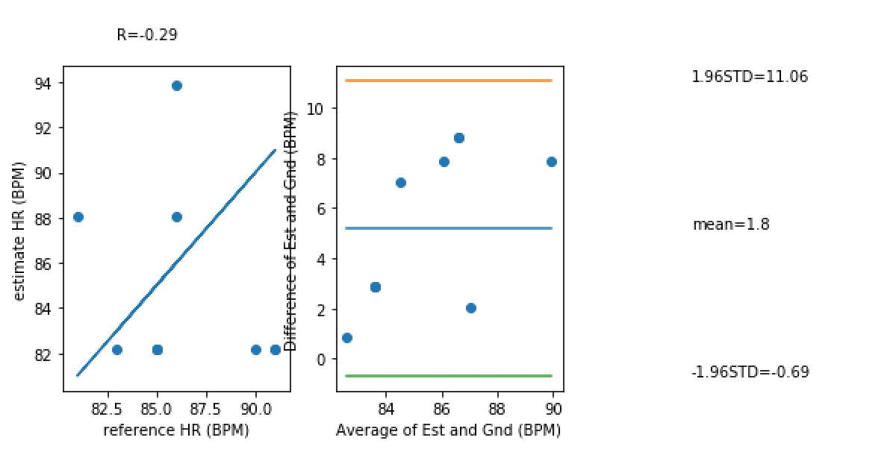

Q. Sketch the correlation plot that would give you an R of 0. What does an R of 0 mean?

> R = 0 means that the fact and the estimation are not related at all. 
>
> An example plot: 
>
> 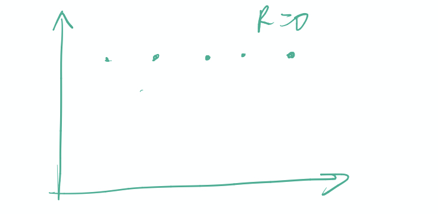

Q. Sketch a scatter plot of the correlation and bland-altman plot if your estimation was perfect every time. What would be the R, RMSE, Bias, and STD value of a perfect estimator?

> 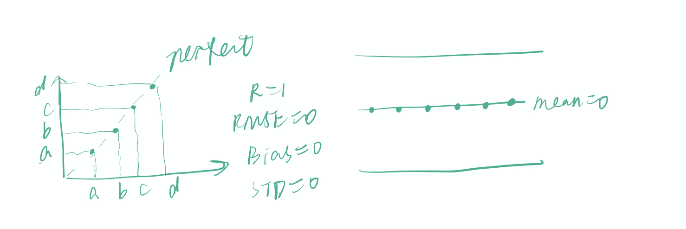

Q. How might we use the 1.96STD mark to assess if a given estimate might be an outlier?

> 1.96 STD basically means that we are sure with the probability 97% that our estimation would be in the  period. 
>
> (95% of the area under the normal distribution lies within *1.96 standard deviations* away from the mean.)

Q. What would your Bland-Altman plot look like if your algorithm always guessed 70BPM regardless of the actual heart rate? Describe some prominent features about the graph beyond just showing it. 

> R would be 0. The number of y axis of each sample would be fixed, which means all the points on the scatter graph would be on one horizontal line.
>
> The Bland-Altman plot: mean = (a fixed number) + real_number/2. Cuz my actualy heart rate is always higher than 70, the higher the real_numebr, the further it is from the , the larger the difference. So, my Bland-Altman is monotonic. 
>
> 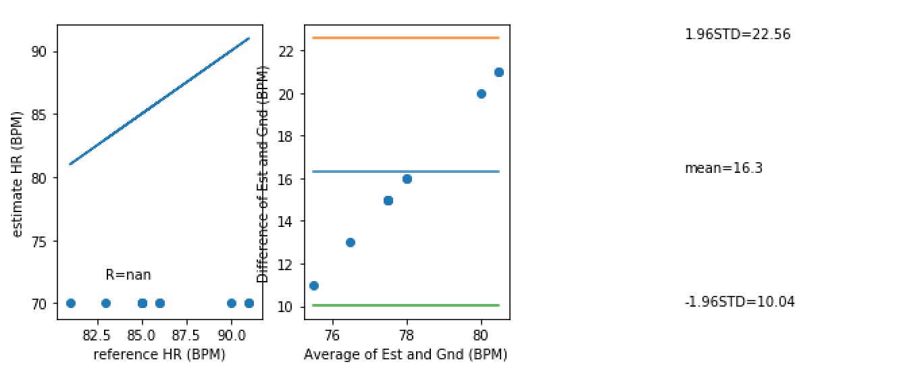

### Tutorial 2 **Frequency Domain**

Using the sample accelerometer data in appendix_a.csv, take a look at the frequency component of the signal in the **x acceleration**. 

Q. If your sampling rate was 120Hz, what would be your maximum frequency (the Nyquist frequency)?

> The Nyquist frequency: half of **the sampling rate** of a discrete signal processing system.
>
> So the maximum frequency: 60Hz. 

Q. If your signal bandwidth is composed of **0-10Hz**, what is your **minimum sampling rate** to capture this signal based on the Nyquist sampling theorem? What would be recommended in general practice however?

> The **minimum sampling rate**: 20Hz. 
>
> Recommended in practice: Nyquist-Shannon sampling theorem is based on the notion that the signal to be sampled must be perfectly band limited, which is not necessarily true for the signal in real world. 
>
> in practice, we sample at least 4*(the maximum frequency component), which is 40 Hz. 

### Tutorial 3 Baseline DC Signal 

First let’s plot the heart rate data from the appendix_a data (which is on column 4). 

>  The plotting 
>
> 
>
> remove the baseline drift by using the detrend function

Now let’s remove the **baseline drift** by using the detrend function. 

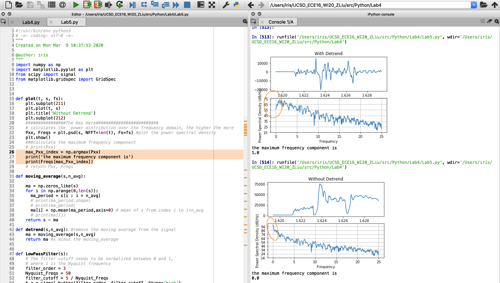

Let’s compare their PSD. 

> Q. How does your detrend function modify the frequency content of the signal? Show the plot and circle the part that is most modified and explain why.

> The low-frequency's (near 0 and 0) power spectral density is decreased. 
>
> Reason: by removing the baseline drift, we were trying to remove the DC component, which is 0-frequency are near-0 frequency component. 

### Tutorial 4 Dominant Frequency Component

We are interested in the dominant frequency component and we can save them in an array. 

Psd function returns the y axis values Pxx and the x axis values freqs. 

Q. Show the code - Use np.argmax to find the actual dominant frequency of the x acceleration (currently labeled as 1Hz in the above plot). The aim here is to use argmax to get the index of the maximum value of Pxx and then use that index to get the corresponding frequency in the Freqs array. Try this with and without removing the DC offset. What do you get?

> With removing DC offset:
>
>  The codes are shown in the pic. above. As shown with the purple arrow, the frequency with the highest Pxx is 1 Hz.
>
> Without removing DC offset:
>
> The prominant frequency is 0.0Hz, which is the frequency of DC offet. 
>
> 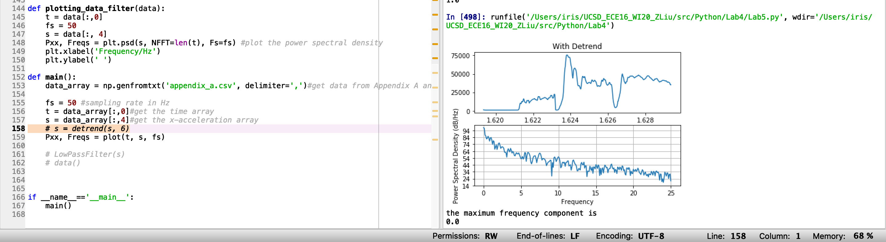

Q. If we don’t remove the DC offset first, how can we index Pxx such that when we calculate argmax, we don’t look at the Pxx[0] (skipping the 0 index).

> Codes are shown in the following pic. 
>
> 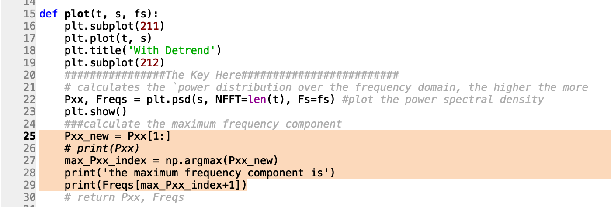

Q. What is the dominant frequency for the y and z acceleration in the sample?

> Codes used are highlighted in the following pic
>
> 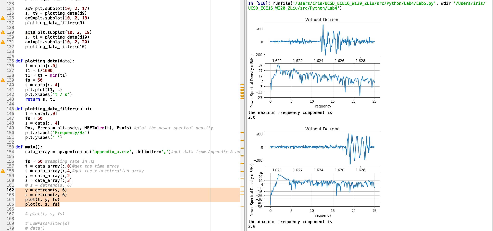
>
> 

## Challenges 

### Challenge 1: Lowpass Filter with Scipy. 

Build a 3rd order lowpass filter with a cutoff at 5Hz. Show as follows: (1) Filter response of low pass filter, (2) Original signal of the pulse signal from Appendix A, (3) PSD of original signal, (4) filtered pulse signal, and (5) PSD of filtered signal.

The required plotting. 

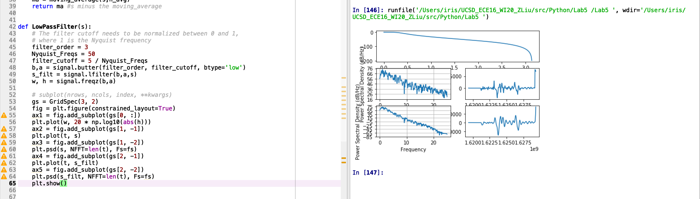

Q. Looking at the documentation for signal.butter, how would you make a high pass filter with a cut off of 0.8Hz? Of the previous time based filters in Lab 4, which filter is most like the high pass filter?

> Codes of the high pass: 
>
> 
>
> Plotting 
>
> 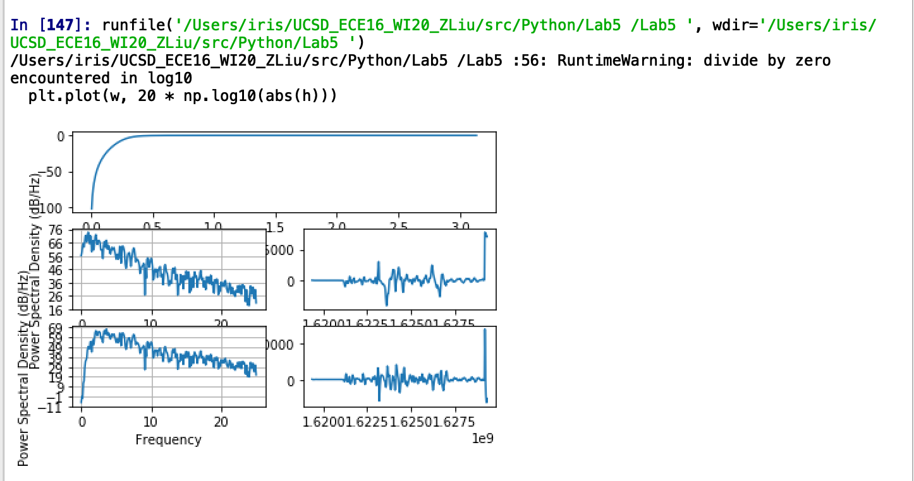

### Challenge 2: The frequency content of PPG 

The marked plotting 

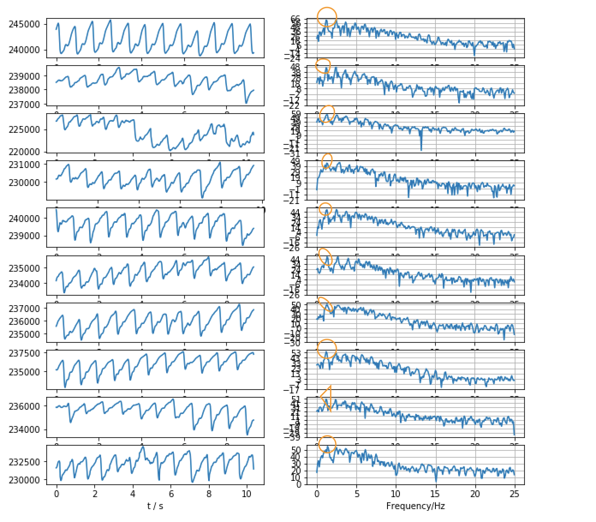

The frequency 

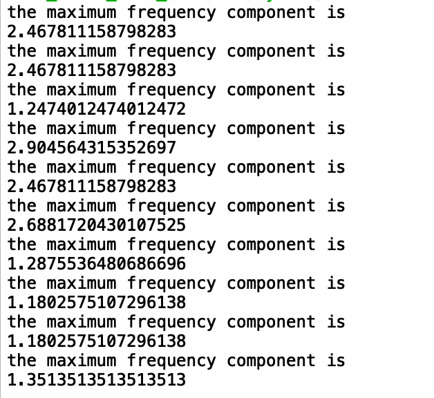

Describe the frequency property:

The majority of power is in the frequency period of 0-5Hz. The power of the high frequency period (15-25Hz) is pretty few. 

> Q. How does the dominant frequency change with regards to the heart rate

> The higher the dominant frequency is, the higher the heart rate is. 

> Q. If the heart rate is 65BPM, what is approximately the fundamental frequency? 

> The hr is 65 means that the hr in each minute is 65, so in each second it is 1.08. So, the fundermental frequency should be 1.08Hz. 

> What about the second and third harmonic? 

> 2nd harmonic frequency: 2.16Hz; 3nd harmonic frequency: 3.24Hz. 

> Q. Why is it that even though the heart rate is 65BPM, there are higher frequency content than just the fundamental frequency? What does this imply about how you should be setting your sampling rate if you expect a heart rate maximum of 180BPM?

> There are noises which are of high-frequency. 
>
> If the hr maximum is expected to be 180BPM, the fundermental frequency is expected to be 3, so the samling rate should be more than 12Hz. 

### Challenge 3: **Calculate Heart Rate with Frequency Domain Features**

Codes: 

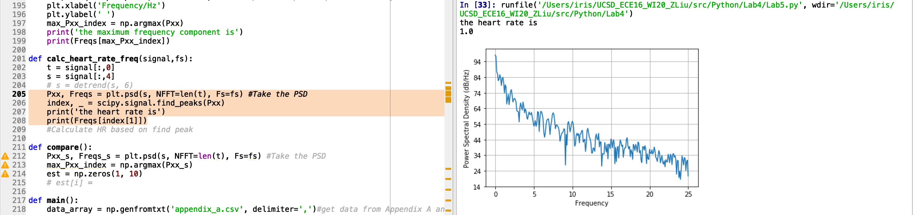

> Q. What are some failure modes of your frequency domain solution?

> A. 
>
> 1. I tried to do detrend and then do print(Freqs[index[0]]) and print(Freqs[index[1]]), but they did not work out very well. I think this is because that the low pass filter could not filter the low-frequency components. So, I gave up using the detrend. 

> Q. Compare and contrast the two different algorithms. Which has a lower error? Which has a bias closer to 0? Do you see any signs of mean tracking in either algorithm? Use the correlation and difference plots to support your argument.

>  Correlation and Bland-Altman Plot of fixed threhold algorithm 
>
>     gnd = [85, 86, 86, 85, 81, 91, 91, 85, 83, 90]
>     est = [82.15568862275448, 93.89221556886227, 88.02395209580837, 82.15568862275448, 
>            88.02395209580837, 82.15568862275448, 82.15568862275448, 82.15568862275448,
>            82.15568862275448, 82.15568862275448]
> 
>
> 
>
>  Correlation and Bland-Altman Plot of frequency domain algorithm
>
> 
>
> 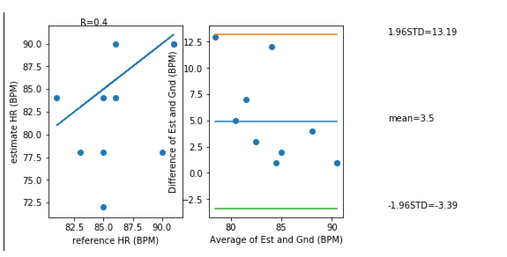

## Tutorial

### **List all files in directory**

Q. what is the correct regex to get trial “0” for any subject given our naming convention “ID_Trial_HR.csv”. 

all_files = glob.glob("/Users/iris/UCSD_ECE16_WI20_ZLiu/src/Python/Lab4/Data/training/*01*.csv")

>  all_files = glob.glob("/Users/iris/UCSD_ECE16_WI20_ZLiu/src/Python/Lab4/Data/*01*.csv") (sorry the asteroid disappeared in markdown. There's respectively one before & after 01)
>
>  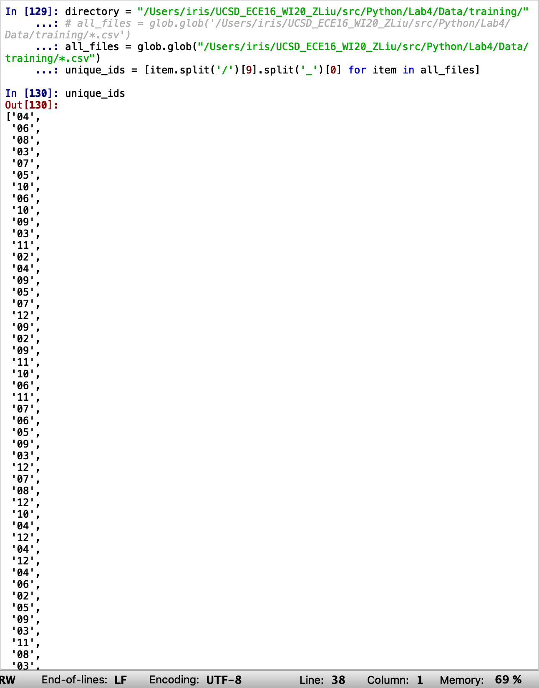

###  **Manipulating filenames**

Get all the unique IDs in our dataset.  &  Use .split to get all the ids. 

> A simple list comprehension is used here to get all the unique ids. 

> Codes: 
>
> <pre><code>unique_ids = [item.split('/')[9].split('_')[0] for item in all_files]</code>

> The unique_ids	: 
>
> 

### Challenge 4: Data for ML 

> Q. According to the lecture, what is the recommended split between training and testing on a small dataset? 

> Train set: 70%; Validation set: 20%; Test set: 10% 
>
> There's no Validation, so I was doing: Train set: 90%, Test set: 10%. 

> Q. Why is it important to split on subjects and **not to treat each file as an independent sample**?

> This is because that, each person's heart beats in a different way. When we test, we want to test using the data of a subject that the algorithm has never seen before. Only in this way can we make sure that the algorithm works well for a strange subject. 

Two folders' way of organizing 

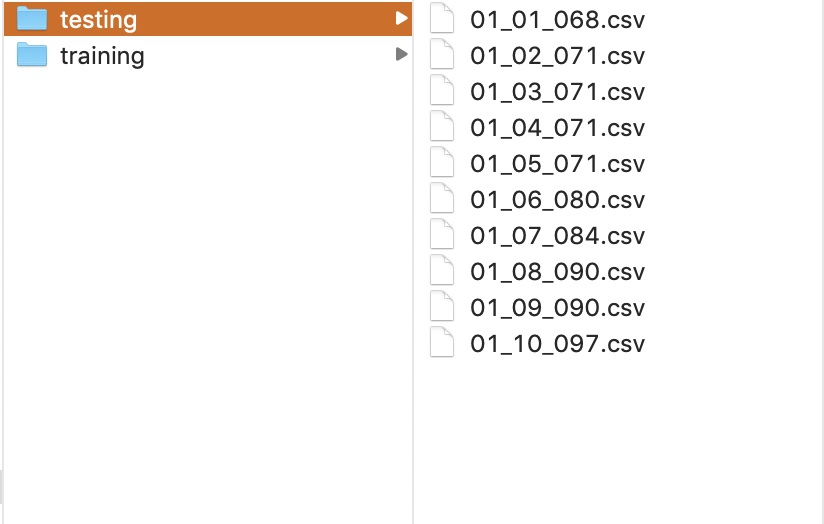

> Find a way to show us documentation that you got this to work.

> For the documentation, I printed out the size & values of list_ref and list_sub, and they seem correct. 
>
> 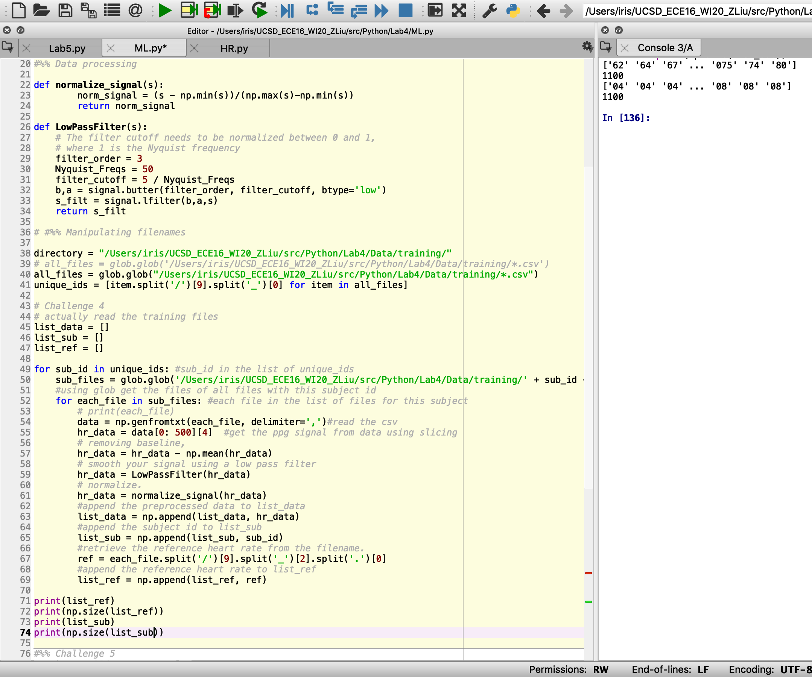

### Challenge 5: Gaussian Mixture Model 

Take advantage of our signal's property to utilize gaussian mixture model to perform peak detection from our PPG using unsupervised learning. 

The sketched 2 Gaussian on the histogram 

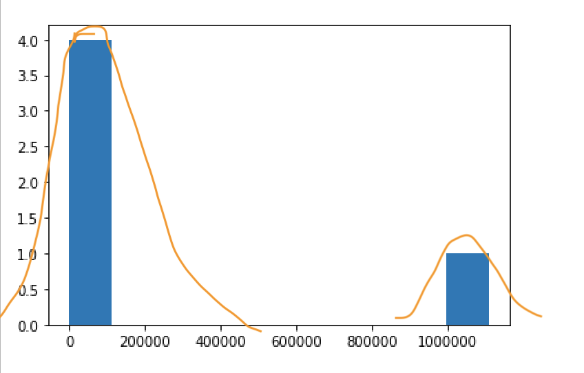

