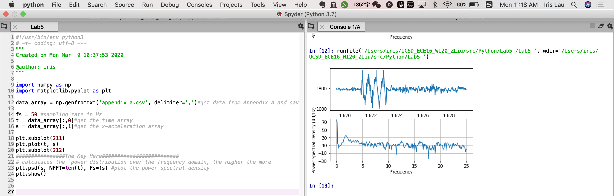
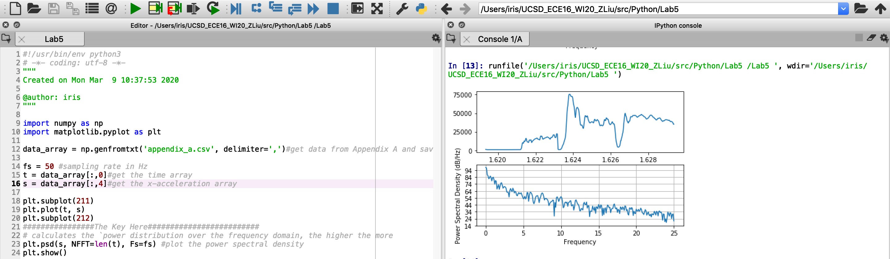

# Lab5 

## Tutorial 

### Tutorial 1: Correlation and Bland-Altman Plot

Q1. Which metric (R,RMSE,STD,Bias) do you use to look at each of the four key analysis?

> How well does your estimation CORRELATE to the actual ground truth reference: R (Correlation coefficient)
>
> How BIASED is your estimate: Mean of Bias 
>
> How PRECISE is your estimate: STD 
>
> How ACCURATE is your estimate: RMSE 

Q2. 

### Tutorial 2 **Frequency Domain**

Using the sample accelerometer data in appendix_a.csv, take a look at the frequency component of the signal in the **x acceleration**. 

Q. If your sampling rate was 120Hz, what would be your maximum frequency (the Nyquist frequency)?

> The Nyquist frequency: half of **the sampling rate** of a discrete signal processing system.
>
> So the maximum frequency: 60Hz. 

Q. If your signal bandwidth is composed of **0-10Hz**, what is your **minimum sampling rate** to capture this signal based on the Nyquist sampling theorem? What would be recommended in general practice however?

> The **minimum sampling rate**: 20Hz. 
>
> Recommended in practice: Nyquist-Shannon sampling theorem is based on the notion that the signal to be sampled must be perfectly band limited, which is not necessarily true for the signal in real world. 

### ？？？ 

### Tutorial 3 Baseline DC Signal 

First let’s plot the heart rate data from the appendix_a data (which is on column 4). Now let’s remove the baseline drift by using the detrend function. Let’s compare their PSD. 

>  The plotting 
>
> 
>
> remove the baseline drift by using the detrend function
>
> 

